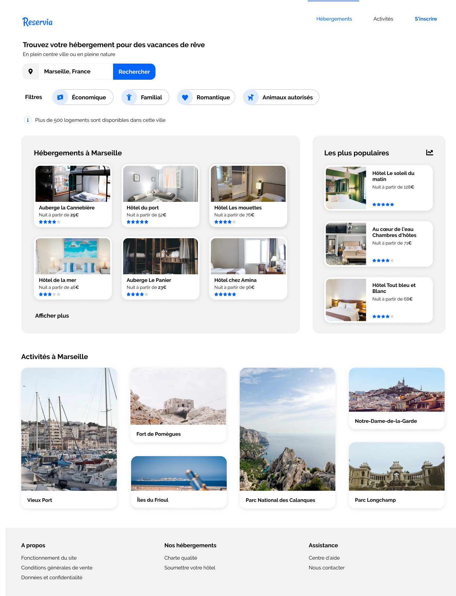

 

<h2 align="center">Projet n° 2</h2>

 

**Introduction**

 

"Reservia" site de réservation en ligne d'hébergements est le deuxième projet que je dois réaliser dans 
le cadre de ma formation "développeur web" avec le site de formation **OpenClassrooms**.

Pour ce projet, je suis stagiaire dans une société qui développe un outil de planification de vacances.

Mon rôle consiste à intégrer les maquettes graphique en utilisant uniquement *HTML* et *CSS*.

 

**************************

 

**Les maquettes**

 

Pour ce projet, nous avons à notre disposition deux maquettes :

 

1. Une version "**Desktop**" 

 

 

2. Une version "**Mobile**" 

 

 

La page doit être responsive aussi pour les tablettes mais la mise en page est libre.

 

**************************

 

**Les contraintes techniques sont :**

 
 
 * Utilisation des balises sémantiques 
 * Versionning du code
 * La charte graphique se compose des trois couleurs suivantes :
    * *Bleu* = #0065FC
    * *Bleu Claire* = #DEEBFF
    * *Gris* (arrière-plan) = #F2F2F2
* La police du site est **Raleway**
* Les icônes viennent de la bibliotèque **Font Awesome**
* Les carte des lieux d'hébergements ou d'activités doivent être cliquable intégralement.
* Dans le Header, "Hébergements" et"Activités" sont des liens menant à leurs sections correspondantes.
* Le champ de recherche doit être éditable.
* Les filtres doivent changer d'apparence au survol.
* La taille des photos doit être choisie pour assurer une résolution suffisante et un temps de chargement le plus court possible.
* Le code ne doit présenter aucune erreur au validateur W3C
* Aucun framwork ne doit être utilisé, seulement flexbox ou grid

 

**************************
